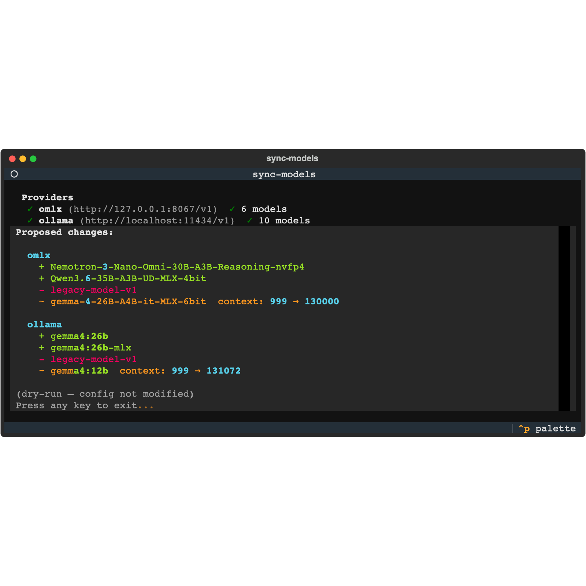

# sync-models

> Keep your OpenCode config in sync with the models actually running on your local
> oMLX and Ollama servers — automatically, with a live terminal UI.

If you run local LLMs and add/remove models often, your
`~/.config/opencode/opencode.json` drifts out of date: models you deleted still show up,
new ones are missing, and Ollama models silently truncate their context to 2048 tokens.
`sync-models` fixes all of that in one pass.

It reads the provider endpoints from your existing config, queries each one for its
available models, and updates the config file — all within a **[Textual](https://textual.textualize.io/)
TUI** that shows live per-provider probing status and per-model progress while baking
`num_ctx`. No interaction required; press any key to exit when done.



## Usage

From the monorepo root:

```bash
# Preview changes without writing anything
uv run sync-models --dry-run

# Run (auto-applies any changes)
uv run sync-models

# Point at a different config
uv run sync-models --config /path/to/opencode.json
```

### Fixing Ollama context truncation

Ollama defaults to a 2048-token context regardless of a model's real maximum (see
[below](#why-ollama-needs-num_ctx)). To bake a larger context into each Ollama model:

```bash
# Bake num_ctx = half each model's architectural max (default)
uv run sync-models --set-num-ctx

# Use a quarter of the max instead (lower RAM)
uv run sync-models --set-num-ctx --ctx-fraction 0.25

# Half, but never above 131072
uv run sync-models --set-num-ctx --max-ctx 131072

# Preview the num_ctx plan without applying
uv run sync-models --dry-run --set-num-ctx
```

| Flag | Default | Description |
|---|---|---|
| `--dry-run` | off | Show the diff/plan without writing the config or modifying models. |
| `--config PATH` | `~/.config/opencode/opencode.json` | Path to the OpenCode config to sync. |
| `--set-num-ctx` | off | Re-create Ollama models with a baked `num_ctx` so they stop truncating to 2048. |
| `--ctx-fraction F` | `0.5` | Target `num_ctx` as a fraction of each model's architectural max. |
| `--max-ctx N` | none | Absolute ceiling on the baked `num_ctx`. |

## What you'll see

The full-screen TUI walks through four stages:

1. **Probing** — each provider row starts as `⏳ probing...` and updates to
   `✓ N models` or `✗ unreachable` as results arrive.
2. **Diff** — pending additions (`+`, green), removals (`-`, red), and context
   changes (`~`, yellow) are listed per provider.
3. **Apply** — if there are changes (and `--dry-run` was not passed), the tool
   auto-applies them. A progress bar tracks overall completion while each model being
   baked shows `⏳ baking num_ctx...` → `✓ done` / `✗ error`.
4. **Exit** — once finished (or on `--dry-run`), `Press any key to exit...` is shown.

## Why Ollama needs `num_ctx`

Ollama defaults to a **2048-token** context at inference time regardless of a model's
architectural max — and its OpenAI-compatible `/v1/chat/completions` endpoint (which
OpenCode uses) **cannot** override this per request. So a model advertising a 256k
context still silently truncates to 2048 unless `num_ctx` is baked into the model.

Because of this:

- For Ollama models, `limit.context` reflects the **effective** baked `num_ctx`
  (read from `/api/show` `parameters`, defaulting to `2048`) — **not** the
  architectural max. This keeps OpenCode from sending more than Ollama honours.
- `--set-num-ctx` re-creates each Ollama model **in place** (`POST /api/create`
  with `from == model`, inheriting weights/template/other params) with a baked
  `num_ctx`, then updates `limit.context` to match.
  - **Target** = `--ctx-fraction` × the model's architectural max (default
    `0.5`, i.e. half). Architectural maxes are often 128k–500k; using the full
    max would allocate a huge KV cache, while a small fixed window is too tight
    for coding agents — half is a sensible middle ground.
  - **`--max-ctx`** (optional) caps the target at an absolute value. By default
    there is no ceiling and the fraction governs.
  - `num_ctx` RAM cost scales roughly linearly, so lower `--ctx-fraction` (or set
    `--max-ctx`) if a model fails to load or you're tight on memory.

## How it works

### Provider detection

| Provider key | URL | Discovery API |
|---|---|---|
| `omlx` | `http://127.0.0.1:8067/v1` | `GET /models` → `data[].max_model_len` |
| `ollama` | `http://localhost:11434/v1` | `GET /v1/models` + `POST /api/show` |

oMLX is detected when the base URL does **not** contain port `11434` and the provider
key is not `"ollama"`. Ollama is detected when the base URL contains `11434` or the
provider key contains `"ollama"`.

### Behaviour notes

- **Vision/multimodal detection** — for oMLX, name heuristics (`_is_vision_by_name`);
  for Ollama, the `capabilities` array from `/api/show`.
- **User edits are preserved** — when a model already exists in config, only
  `limit.context` is updated on sync; friendly names and modalities you set are kept.
- **Output limits** — oMLX models default to `32768`, Ollama models default to `8192`.

### Provider entry shape

`sync-models` reads and writes provider entries in this shape:

```json
{
  "npm": "@ai-sdk/openai-compatible",
  "name": "Human-readable label",
  "options": { "baseURL": "...", "apiKey": "..." },
  "models": {
    "<model-id>": {
      "name": "Friendly name",
      "modalities": { "input": ["text"], "output": ["text"] },
      "attachment": false,
      "limit": { "context": 131072, "output": 8192 }
    }
  }
}
```
